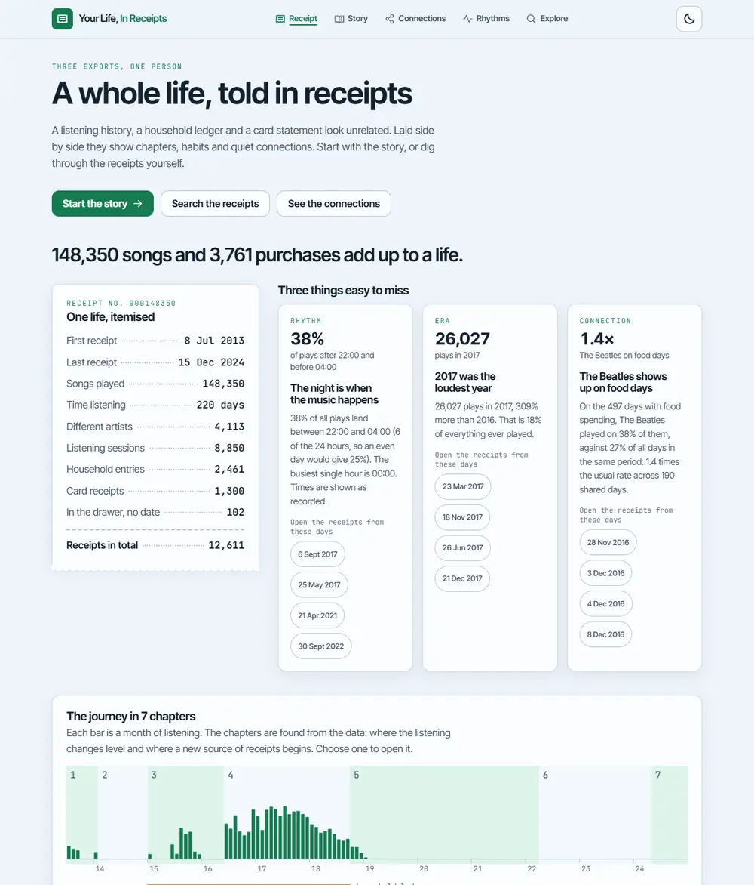
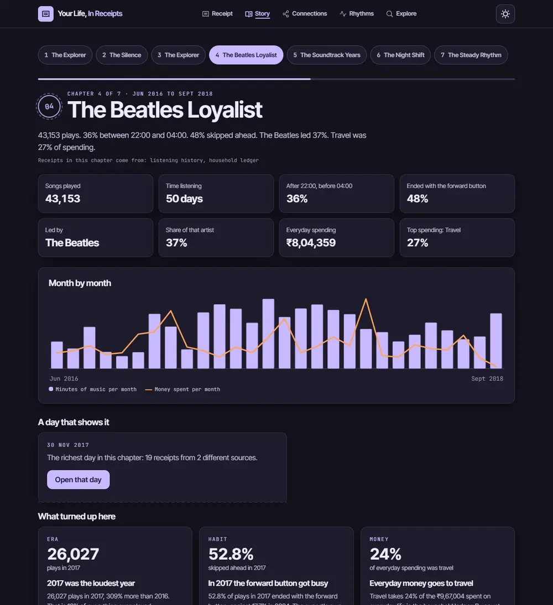
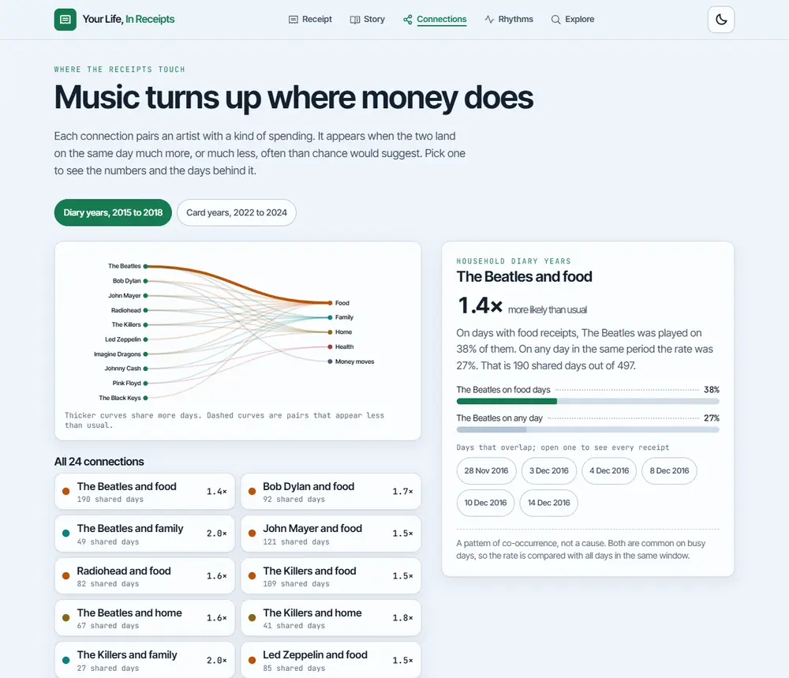
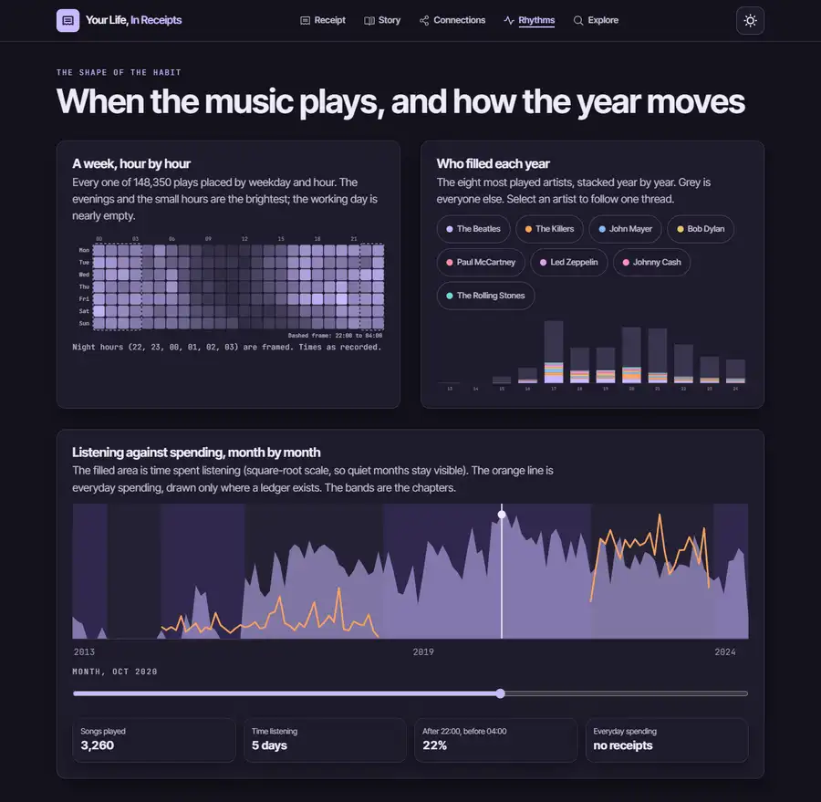
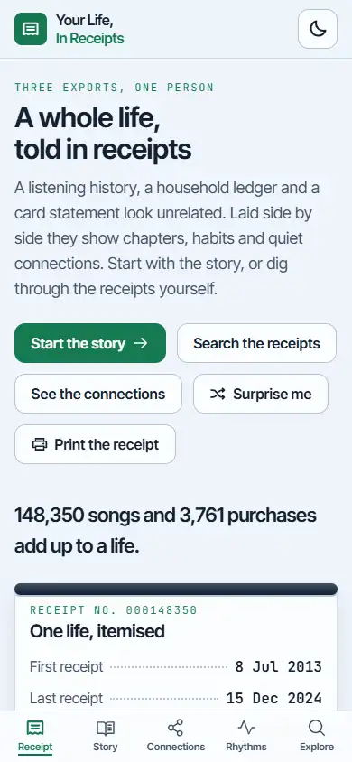

# Your Life, In Receipts

An interactive data story built from three unrelated exports: a listening history of 148,350 plays, a household ledger of 2,461 entries and a card statement of 1,300 receipts. The app finds chapters, habits and hidden connections in them and lets you follow each finding back to the days it came from.

Live demo: https://your-life-in-receipts-sand.vercel.app



## Overview

Every receipt on its own is trivial: a song at 2 AM, a bag of milk, a train ticket. Laid side by side they tell a story. The app turns the raw rows into three layers:

1. **Insights**: numbers with a sentence, such as "38% of all plays land between 22:00 and 04:00".
2. **Connections**: an artist and a kind of spending that keep landing on the same days, with the days listed.
3. **Chapters**: seven stretches of the timeline, each named after what sets it apart ("The Night Shift", "The Beatles Loyalist").

Nothing is invented. Every number is computed from the receipts, every finding lists the days it was found on, and the Method page says what was cleaned, what was left out and what the app cannot know.

## Features

| Requirement in the brief                      | How it is met                                                                                                                                                                             |
| --------------------------------------------- | ----------------------------------------------------------------------------------------------------------------------------------------------------------------------------------------- |
| Explore the receipts                          | **Explore** searches all 12,611 receipts at once, filters by kind, theme and years, sorts four ways, and opens any receipt onto the whole day around it                                   |
| Meaningful filtering, searching or navigation | Search terms all have to match; kind, theme and year filters combine; the count, the minutes of music and the money spent update as you type                                              |
| A way to discover relationships or patterns   | **Connections** pairs artists with kinds of spending using how often they share a day compared with any day; **Rhythms** shows the weekly heatmap and listening against spending by month |
| An interactive storytelling experience        | **Story** walks through seven chapters found from the data, each with its own numbers, chart, a "day that shows it" and the findings that belong to it                                    |
| A clear visual representation of the journey  | The journey strip on the home page: every month of listening as a bar, the chapters as bands, and the spans covered by the ledger and the card underneath                                 |
| Responsive design                             | Verified at nine widths from 320 px to 2560 px on every page, with a bottom navigation on phones                                                                                          |

Also included: a light theme (subtle blue base, green accents) and a dark theme (light lavender highlight), a day drawer with earlier and later day buttons, a keyboard-first interface, and honest handling of missing and duplicated data.

## Screenshots









## Tech stack

| Layer        | Choice                                                                         | Why                                                                                         |
| ------------ | ------------------------------------------------------------------------------ | ------------------------------------------------------------------------------------------- |
| UI           | React 19                                                                       | Lazy routes with Suspense, `useDeferredValue`, `useSyncExternalStore`, concurrent rendering |
| Language     | TypeScript 6, strict                                                           | Every data shape is typed and validated at the edge                                         |
| Build        | Vite 8                                                                         | Fast builds, module workers, code splitting                                                 |
| Styling      | Tailwind CSS 4 with CSS custom properties                                      | Tokens for both themes; container queries, `color-mix()`, `dvh` units, view transitions     |
| Icons        | Phosphor                                                                       | Tree-shaken, one family                                                                     |
| Fonts        | Inter Tight (variable) and JetBrains Mono, self-hosted                         | No third-party requests                                                                     |
| Tests        | Vitest 5, Testing Library, jsdom                                               | 55 tests, 96% line coverage                                                                 |
| Verification | Playwright, axe-core, Lighthouse                                               | Every requirement is checked in a real browser                                              |
| Quality      | ESLint 9 (flat config, jsx-a11y, react-hooks, sonarjs), Prettier, EditorConfig | Zero errors and zero warnings                                                               |
| Hosting      | Vercel                                                                         | Static build with cache and security headers                                                |

The whole app is frontend only. There is no backend, no database and no network call other than fetching its own three JSON files.

## Getting started

```bash
npm install
npm run dev          # http://localhost:5173
npm run build        # type-check and production build
npm run preview      # serve the production build
npm test             # run all tests
npm run coverage     # tests with a coverage report and thresholds
npm run lint         # ESLint, zero warnings allowed
npm run format:check # Prettier
```

The raw datasets are not in the repository. `scripts/build-data.mjs` compiles them into `public/data/*.json` (about 640 KB together); those compiled files are committed, so the app runs without the raw files.

## Architecture

```
src/
  app/                      App root and error boundary
  layouts/                  The frame around every page
  routes/                   Lazy page map
  pages/                    One file per route: Home, Story, Connections, Rhythms, Explore, Method
  features/
    data/                   Types, decoding and validation, the loader, the worker
    insights/               Pure functions: series, chapters, personas, links, insights
    story/                  Insight cards, chapter view, journey strip, totals receipt
    connections/            Arc diagram, link detail
    rhythms/                Heatmap, monthly journey, artist streams
    explore/                Search and filter logic, controls
  components/               Header, drawer, receipt row, page title, data gate
  context/                  Data and drawer providers and their hooks
  hooks/                    Hash routing, theme, heading focus
  services/                 The only file that touches localStorage
  utils/                    Time and number formatting
  constants/                Themes, labels, storage keys
  types/                    Shared domain types in one place
  styles/                   Tokens, base, components, motion
scripts/                    Data build and the verification scripts
tests/                      Unit, integration and independent-recomputation tests
```

Decisions worth knowing:

- **Logic is pure.** Everything that finds a chapter, a link or an insight is a pure function of the decoded data, so it is tested without a browser.
- **The engine runs in a worker.** Decoding and analysis take about 300 ms, so they run off the main thread. The story and totals arrive first, then the receipts in chunks of 1,500, so no single task keeps the page busy.
- **Validation at the edge.** Compiled files are checked as they are decoded; a malformed file rejects with a readable error and a retry button.
- **No routing library.** A small hash router built on `useSyncExternalStore` gives back and forward for free and works on any static host. Route changes cross-fade with the View Transitions API where it exists.

See `ARCHITECTURE.md` for the data flow and the reasoning behind the insight methods.

## Components and hooks

| Name                                         | Kind              | Purpose                                                       |
| -------------------------------------------- | ----------------- | ------------------------------------------------------------- |
| `DataProvider`, `useData`, `useReady`        | context and hooks | Load the data once, expose it, offer a retry                  |
| `DrawerProvider`, `useDrawer`                | context and hook  | Open the day drawer from anywhere                             |
| `useHashRoute`                               | hook              | Route and query from the URL hash, with view transitions      |
| `useTheme`                                   | hook              | Light or dark theme, saved and applied before first paint     |
| `useFocusHeading`                            | hook              | Move focus to the new heading after a route or chapter change |
| `AppHeader`                                  | component         | Top navigation on desktop, bottom navigation on phones        |
| `DayDrawer`                                  | component         | Native `<dialog>` showing everything recorded on one day      |
| `ReceiptRow`                                 | component         | One receipt as a printed line                                 |
| `InsightCard`                                | component         | A finding, its number and the days behind it                  |
| `JourneyStrip`                               | component         | Monthly listening, chapters and source coverage in one SVG    |
| `ChapterView`, `ChapterBars`                 | components        | One chapter of the story with its month-by-month chart        |
| `ArcDiagram`, `LinkDetail`                   | components        | The connections between artists and kinds of spending         |
| `Heatmap`, `MonthlyJourney`, `ArtistStreams` | components        | The rhythm charts, each with a text alternative               |
| `ExploreControls`                            | component         | Search, kind chips, theme, years and order                    |

## Data and method

Three files were supplied: a Spotify listening export, a household transactions ledger and an Indian card statement. They cover different years (2013 to 2024, 2015 to 2018 and 2022 to 2024), so the app treats them as one fictional life and says so.

What was found and done:

- **Listening**: 1,510 duplicate plays were removed. Plays within 30 minutes of each other form one of 8,850 sessions. The export's own `skipped` flag is filled in for only some years (79% in 2015, 0% in 2018), so a skip means the forward button ended the track.
- **Ledger**: dates are day/month/year. Money that moved through savings and investments is kept out of "everyday spending".
- **Card statement**: 10,267 rows held only 1,404 distinct transactions. Copies were merged, each blank field filled from another copy. 102 receipts with no date are kept in "The drawer": searchable, but they cannot join a day. The stated coordinates do not match the stated cities, so no map is drawn.
- **Chapters** are cut where a source begins or ends and where monthly listening changes level the most, then named after the trait that sets each apart from the whole timeline.
- **Connections** compare how often an artist plays on days with a kind of spending against any day in the same period. They show co-occurrence, not cause, and the page says so.
- Times are shown as recorded, with no timezone shift.

## Testing

`npm test` runs 55 tests in Vitest: decoding and validation, the insight engine, search and filtering, formatting, storage, and full-app integration tests that render every page against the real compiled data, step through the story, search, open the drawer and switch theme. Coverage is enforced by thresholds in `vite.config.ts`: currently 96% of lines. Beyond unit tests, `scripts/verify-*.mjs` check the built app in a real browser; see the list below.

`scripts/verify-insights.mjs` recomputes the headline numbers from the raw CSV files with separate code and checks that the app agrees: the night share, the most played artist and count, the loudest year, the forward-button year and rate, the spending split and the strongest connection.

## Accessibility

- Semantic landmarks, one `h1` per page, a skip link that stays on the page, and focus moved to the new heading after every route or chapter change.
- Every action works from the keyboard, with a visible focus ring; the drawer is a native `<dialog>` with focus trapping and Escape.
- Charts have text alternatives: labelled images, a hidden data table for the heatmap, a slider to read any month and a list twin for the connection diagram.
- Contrast is at least 4.5 to 1 for text and 3 to 1 for graphics in both themes, checked by a script.
- axe finds no violations on any page in either theme, including with the drawer open.
- Touch targets are at least 44 px, and `prefers-reduced-motion` and `prefers-color-scheme` are honoured.

## Performance

Measured on the production build with Lighthouse mobile (4x CPU slowdown, slow 4G), median of three runs: performance 94, accessibility 100, best practices 100, SEO 100. First Contentful Paint 1.7 s, layout shift 0.000, total blocking time 220 ms. The initial JavaScript is 82 KB gzipped; the data (about 640 KB) loads after the first paint and is parsed off the main thread. A static first-paint shell matches the real layout so nothing moves when React takes over.

Motion uses only `transform` and `opacity`, every animation is 300 ms or shorter, and reduced motion removes movement and keeps short fades. `scripts/verify-motion.mjs` measures all of this from the animations the browser actually runs.

## Security

- No raw HTML sinks (`innerHTML`, `dangerouslySetInnerHTML`, `eval`); all text is rendered through React.
- The search box is length limited; stored data (the theme only) is validated on read behind one guarded service.
- `npm audit` reports no vulnerabilities in production dependencies, and there are only four runtime dependencies.
- `vercel.json` sets a strict Content Security Policy (no inline or eval scripts, `frame-ancestors 'none'`), `nosniff`, a referrer policy and a permissions policy. `scripts/verify-security.mjs` runs the built app under that exact policy and fails on any violation.

## Deployment

A static build on Vercel: build command `npm run build`, output `dist`. `vercel.json` sets long-lived caching for hashed assets and the security headers. Continuous integration (`.github/workflows/ci.yml`) runs lint, type-check, coverage and the build on every push.

## Verification

The project was built against a ledger of measurable gates (`GATES.md`). Each one has a script, and all of them run on the production build:

| Gate                                                       | Script                           |
| ---------------------------------------------------------- | -------------------------------- |
| Lint, strict types, formatting, build                      | `verify-tooling`                 |
| Tests and coverage                                         | `verify-tests`                   |
| Data reconciled with the raw files                         | `verify-data`, `verify-insights` |
| Search, connections, story, journey work in a real browser | `verify-features`                |
| axe and keyboard use, both themes                          | `verify-a11y`                    |
| No overflow at nine widths                                 | `verify-responsive`              |
| Palette follows the brief, contrast                        | `verify-theme`                   |
| Motion limits                                              | `verify-motion`                  |
| Lighthouse, bundle size                                    | `verify-efficiency`              |
| Security                                                   | `verify-security`                |
| Modern stack                                               | `verify-stack`                   |

## Credits

Built for the WebRush hackathon. The three datasets were supplied by the organisers and are fictional. Fonts are used under the SIL Open Font License; icons are Phosphor (MIT).
